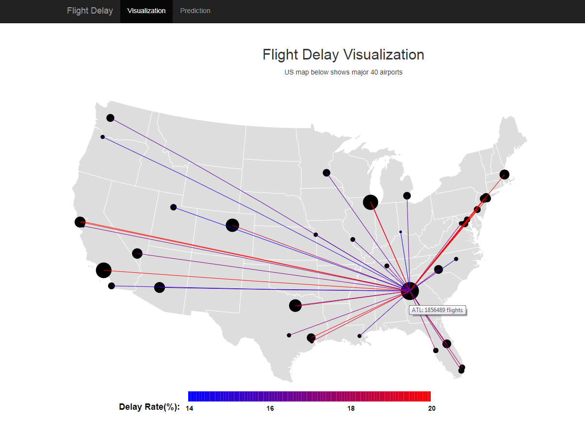
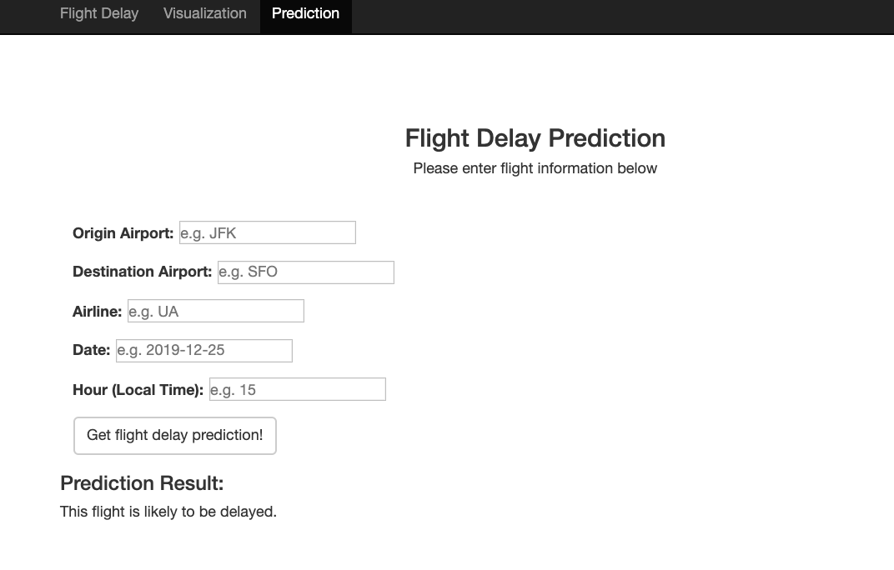

# Flight Delay Prediction and Visualization

## Table of Contents
* [DESCRIPTION](#DESCIPTION)
* [INSTALLATION](#INSTALLATION)
* [EXECUTION](#EXECUTION)
* [DEMO](#DEMO)

## DESCRIPTION
The goal of our project is to help travelers to better plan their trips with better understanding of the flight schedule. This web application includes two part with visualizing the historical flight delay condition and prediciting the flight delay with flight information and weather forcasting.

The visualization is built with d3. The back-end is using Flask with python to serve data and read the model. The predictive model is trained with scikit-learn using RandomForest Classifier.

Inside CODE folder, there are two folders. Notebooks folder contains Python Jupyter notebooks for data cleaning, analysis and machine learning. FlightDelay folder is the implementation of web application. Inside FlightDelay, model stores pre-built Random Forest models; app contains the view file, model prediction code, and templates for each web page. The static folder contains javascripts, css, and data read by the app.

## INSTALLATION
1. Install python (python 3.7) and needed packages and we e suggest to install through https://www.anaconda.com/distribution/.
    * Requirements (If you want to install packages separately):
        * Flask == 0.12.1
        * sklearn == 0.19.1
        * numpy == 1.13.3
        * pickle == 4.0
        * pandas == 0.23.4
        * urllib == 3.5
        * json == 2.0.9
2. We are using version 5 of D3 and Chrome browser.

## EXECUTION
1. Go into FlightDelay/ folder. Run `python run.py` in terminal.
2. Open the localhost as suggested in the terminal through browser. (e.g. `http://127.0.0.1:5000/`)
3. Visualization tab shows the flight delay rate in the map. Hover the mouth over the airport for flight dealy informatin.

4. For prediction, you need input the corresponding information with Origin Airport, Destination Airport, Airline, Date, Hour and then Click the button of `Get Flight delay prediction!`

## DEMO
Link: https://youtu.be/GGUCErIsflg